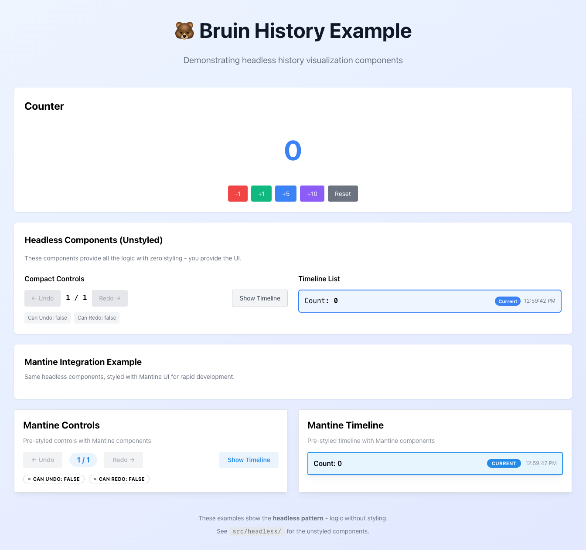

# Bruin History Visualization Examples

Reference implementations showing how to build history visualization UIs with Bruin.

These are **examples to learn from and copy**, not a component library to install.



## 🎯 Start Here: Headless Components

The `/src/headless` directory contains unstyled components with zero dependencies.
These work with ANY UI library or styling approach.

### Quick Start

```bash
# Install dependencies
pnpm install

# Start dev server
pnpm dev
```

Open [http://localhost:5173](http://localhost:5173) to see the demo.

## What's Inside

### Headless Components (`/src/headless`)

Core functionality with zero styling:

- **HeadlessTimelineList** - List-based timeline with custom entry renderer
- **HeadlessTimelineCompact** - Compact undo/redo controls
- **useHistoryState** - React hook for history state

**Why headless?**
- ✅ No UI library lock-in
- ✅ Maximum flexibility
- ✅ Zero dependencies (beyond React)
- ✅ Learn the patterns first

### Demo Application (`/src/main.tsx`)

The demo shows:
1. Counter with multiple actions that create history
2. Headless components with inline styles (completely unstyled pattern)
3. Mantine integration example (pre-styled with UI framework)
4. Undo/redo controls and full timeline visualization

**Styling:** Uses inline styles for headless examples, Mantine for framework integration demo

## Usage Examples

### HeadlessTimelineList

```tsx
import { HeadlessTimelineList } from './headless';

<HeadlessTimelineList
  store={myStore}
  renderEntry={(entry, index, isCurrent) => (
    <div className={isCurrent ? 'current' : ''}>
      <strong>{entry.name || 'Unnamed'}</strong>
      <time>{new Date(entry.timestamp).toLocaleTimeString()}</time>
    </div>
  )}
/>
```

### HeadlessTimelineCompact

```tsx
import { HeadlessTimelineCompact } from './headless';

<HeadlessTimelineCompact
  store={myStore}
  renderControls={({ canUndo, canRedo, undo, redo, currentIndex, totalEntries }) => (
    <div className="flex gap-2">
      <button onClick={undo} disabled={!canUndo}>←</button>
      <span>{currentIndex + 1} / {totalEntries}</span>
      <button onClick={redo} disabled={!canRedo}>→</button>
    </div>
  )}
/>
```

### useHistoryState Hook

```tsx
import { useHistoryState } from './headless';

function MyComponent() {
  const { history, currentIndex, canUndo, canRedo, undo, redo } = useHistoryState(myStore);

  return (
    <div>
      <button onClick={undo} disabled={!canUndo}>Undo</button>
      <span>Position: {currentIndex + 1} of {history.length}</span>
      <button onClick={redo} disabled={!canRedo}>Redo</button>
    </div>
  );
}
```

## Customization

**All components are examples** - copy and modify for your needs!

### Styling Approaches

The headless components work with any styling solution:

- **Inline Styles**: Like the headless demo - simple and portable
- **Tailwind CSS**: Use utility classes
- **CSS Modules**: Import your styles
- **Styled Components**: Wrap in styled components
- **Plain CSS**: Use className prop
- **UI Libraries**: Mantine (example included), Radix, MUI, Chakra, etc.

### Adding Features

Consider adding:
- Search/filter history entries
- Export/import history as JSON
- Diff view between states
- Visual branching for undo trees
- Performance metrics
- Memory usage indicators
- Keyboard shortcuts (Cmd+Z, Cmd+Shift+Z)

## What's Included

- `/src/integrations/WithMantine` - Example integration with Mantine UI
- Learn the headless pattern first, then see how to integrate with a UI framework

## File Structure

```
examples/history/
├── src/
│   ├── headless/              # Headless components (START HERE)
│   │   ├── types.ts
│   │   ├── useHistoryState.ts
│   │   ├── HeadlessTimelineList.tsx
│   │   ├── HeadlessTimelineCompact.tsx
│   │   ├── index.ts
│   │   └── README.md
│   ├── integrations/
│   │   └── WithMantine/       # Mantine integration example
│   └── main.tsx               # Demo application
├── index.html
├── package.json
├── tsconfig.json
├── vite.config.ts
└── README.md (this file)
```

## Learn More

- [Bruin Documentation](../../docs)
- [History & Time Travel Guide](../../docs/guides/history-and-time-travel.md)
- [Core API Documentation](../../docs/apis/create-store.md)

## License

MIT - Same as Bruin core
